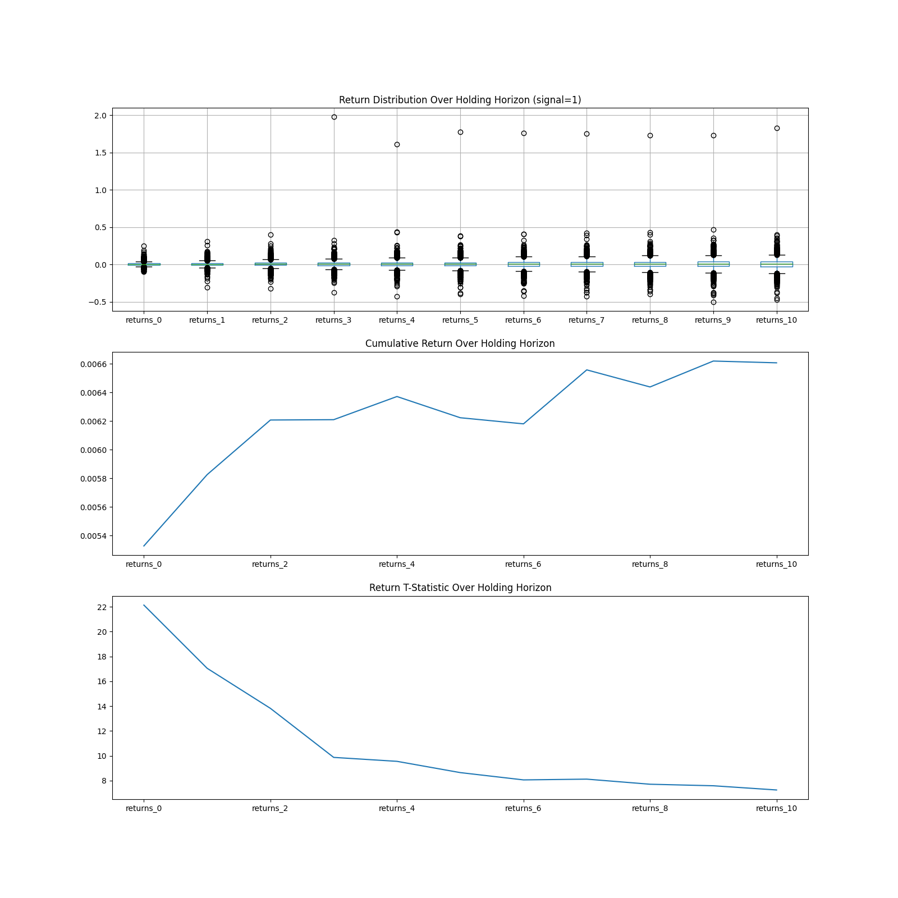

# How to use
## Computing post-event returns
	python ./event_drive_returns.py ./signal.csv
Replace `./signal.csv` with path to signal file. 
Make sure the signal file matches the columns of `signal.csv`.

## Plotting library
Call the function `event_driven_plot` and it will return a `Figure` object
to display charts. Set the parameter `event` to desired signal/event you wish
to plot.

Example: 
